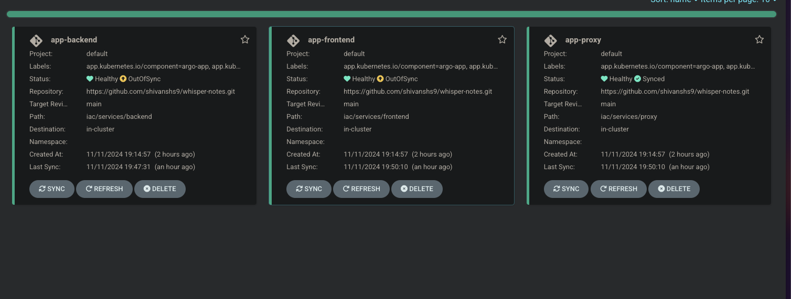

# K8s manifests

## Deployment

If everything is provisioned correctly in the [infra steps](../pulumi-gcp/), then these manifests should start to deploy automatically on the frontend using ArgoCD.

1. Navigate to the URL configured for ArgoCD and login with below creds:
```yaml
username: admin
password: output of $(kubectl -n argocd get secret argocd-initial-admin-secret -oyaml | yq '.data.password' | base64 -d)
```
2. Confirm the deployment status for each app, will look like this:


## Customization

Search for string "CHANGEME" in the subfolder and update the values as instructed.
